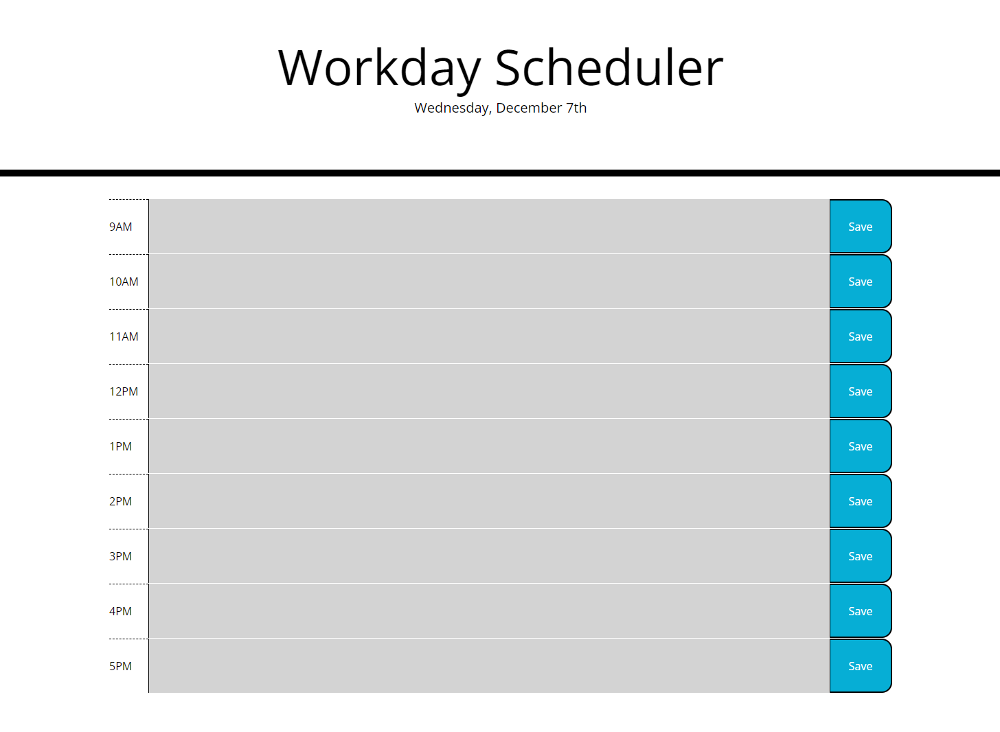

# Work Day Scheduler

A scheduling application that shows the hours in a standard workday, color-coded based on whether an hour block is in the past, present, or future.

By entering tasks into the hour blocks and clicking the corresponding Save button, users can store tasks in local storage and still see them when the page is reloaded.

Link to deployed application:
https://connermart.github.io/work-day-scheduler/
